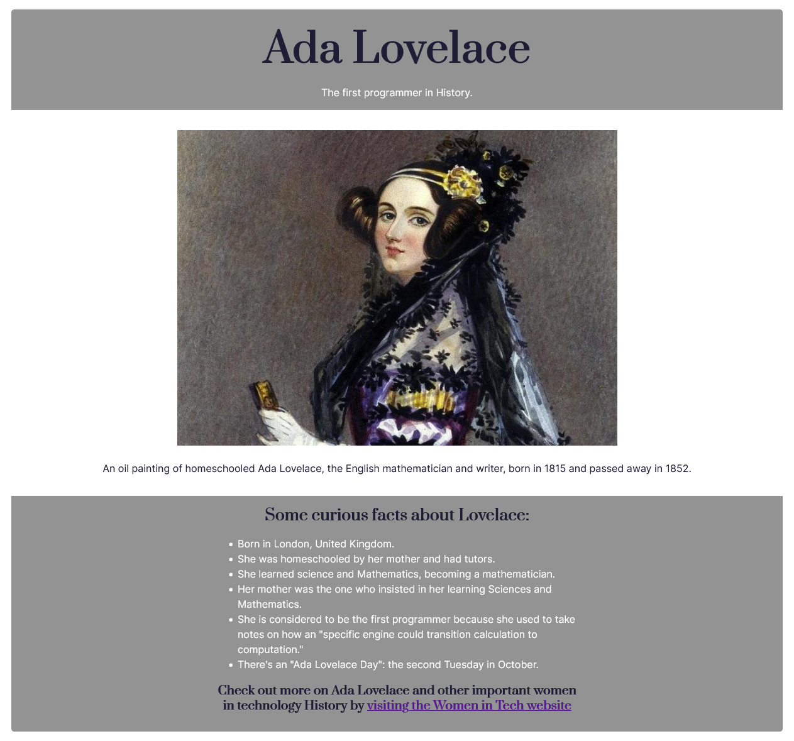

_This README.md file is in English and Portuguese. // Esse arquivo README.md está em Inglês e Português._

# EN: Freecodecamp #01 Responsive Web Design Project: Tribute Page

This repository contains my solution to the freecodecamp #01 challenge on "Responsive Web Design Project". This is part of a series of incremental HTML and CSS Projects in order to obtain the "Responsive Web Design" certificate from Freecodechallenge.

This first challenge was supposed to create a very simple Tribute Page with HTML and CSS. There are other challenges coming, this is only the very first one: the main goal is to practice the content seen in the course in order to achieve the necessary solution required to go to the next step.

In my case, I chose to make a very simple Tribute Page to Ada Lovelace.

### MY SOLUTION

# EN: Freecodecamp #01 Responsive Web Design Project: Tribute Page

Esse repositório contém a minha solução para o desafio número 01 do freecodecamp do curso "Responsive Web Design". Isso é parte de uma série de projetos incrementais em HTML e CSS requisitados para obtenção do certificado em "Responsive Web Design" do Freecodecamp.

Esse primeiro desafio era para criar um versão muito simples de uma página tributo ("homenagem") feita apenas em HTML e CSS. Outros desafios seguem na sequência, mas esse é o primeiro: o principal objetivo é praticar o conteúdo visto no curso e alcançar a solução necessária para ir para a próxima etapa.

No meu caso, eu escolhi fazer uma página muito simples sobre a Ada Lovelace.

### MY SOLUTION
